# Rich Comfort Hotel - Website Build Evidence (richchotel.com)

This folder documents the configuration and operational setup of the Rich Comfort Hotel WordPress website, including booking flow, room setup, pricing, forms integration, customer email workflow, and engagement reporting.

**Live site:** https://richchotel.com/

---

## What’s covered here
- Room/amenities setup and pricing configuration
- Booking form formatting and booking engine integration
- Payments notice configuration (offline / instructions-based flow)
- WPForms integration (enquiry/booking support where needed)
- Customer email workflow integration
- Website visits + engagement reporting

---

## Screenshots (click to expand)

  
<strong>amenities_setup_richchotel.com.jpeg</strong>

  **What this shows:** Amenities configuration used to standardise what is displayed per room/property (e.g., features, facilities, and guest expectations).  
  **Why it matters:** Improves listing clarity and reduces booking friction by making room features consistent and easy to scan.

  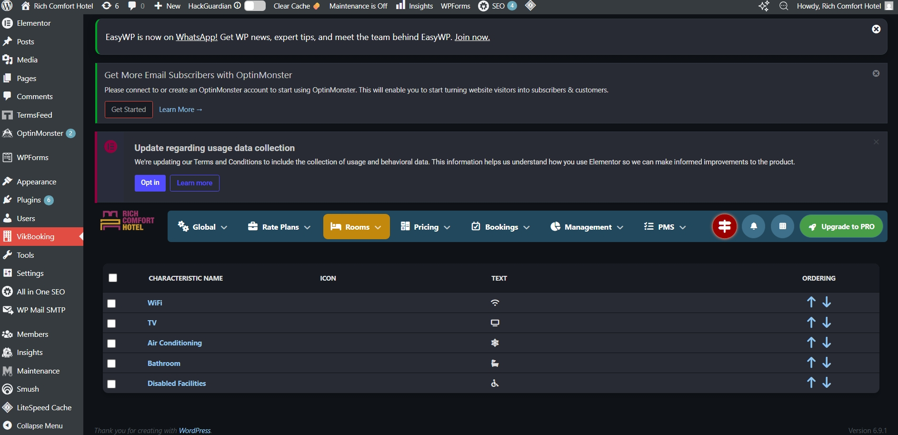

  
<strong>bedroom_setup_richchotel.com.jpeg</strong>

  **What this shows:** Room/bedroom entity creation in the booking system (defining the accommodation unit that guests will book).  
  **Why it matters:** This is the foundation for availability, pricing rules, occupancy rules, and booking confirmation content.

  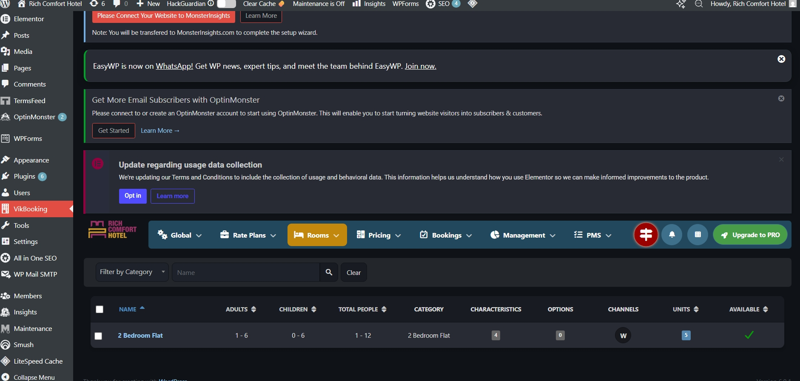

  
<strong>bedroom_pricing_setup_richchotel.com.jpeg</strong>

  **What this shows:** Pricing setup for the room/accommodation unit (base rate configuration and pricing rules).  
  **Why it matters:** Ensures correct nightly price calculation and supports consistent revenue reporting and guest billing.

  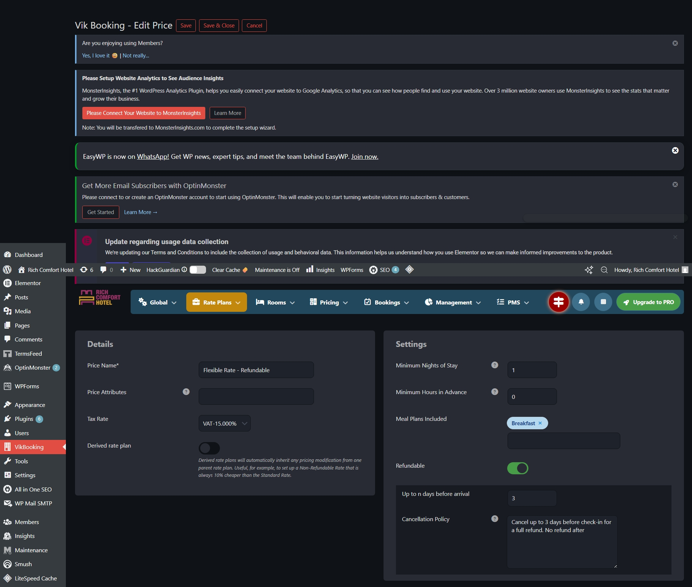

  
<strong>billing-info_setup_richchotel.com.jpeg</strong>

  **What this shows:** Billing information fields setup (customer details collected during checkout).  
  **Why it matters:** Ensures legally and operationally relevant guest data is captured for confirmations, invoicing, and check-in processes.

  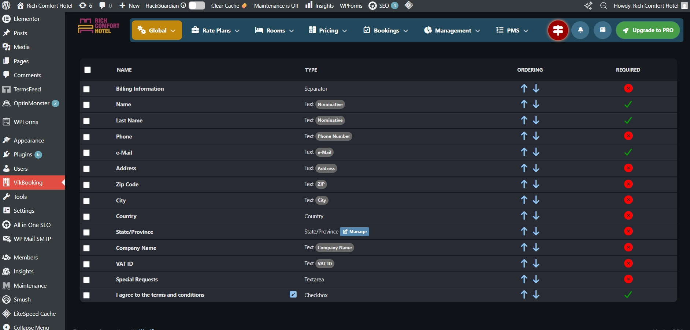

  
<strong>currency&tax_setup_richchotel.com.jpeg</strong>

  **What this shows:** Currency and tax configuration for the booking environment.  
  **Why it matters:** Prevents incorrect totals at checkout and keeps pricing aligned with local business rules.

  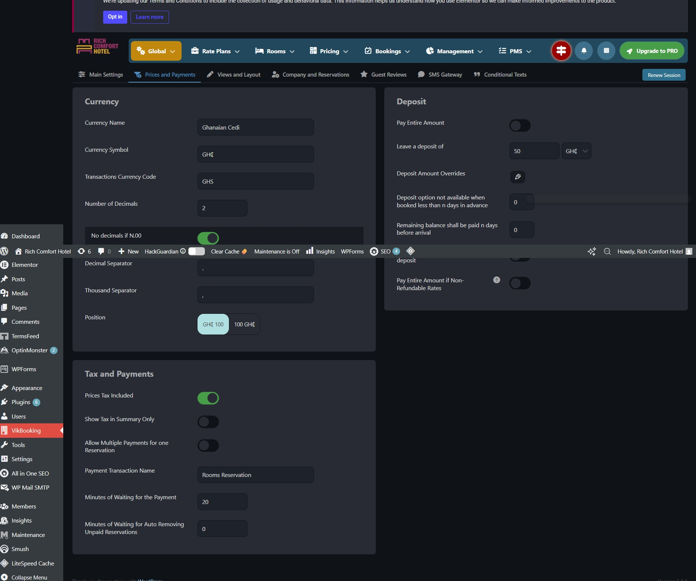

  
<strong>main_booking-form_setting&integration_richchotel.com.jpeg</strong>

  **What this shows:** Core booking form settings and integration configuration (how the booking form is wired into the website flow).  
  **Why it matters:** Controls the booking journey end-to-end (availability search → guest details → confirmation).

  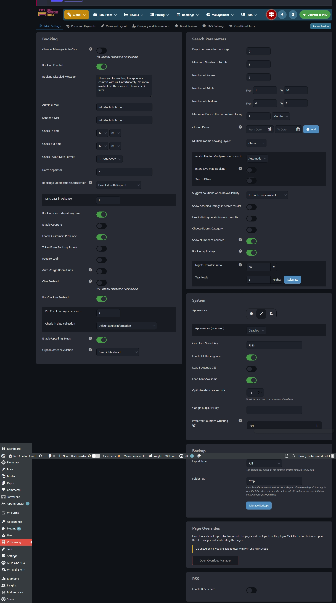

  
<strong>booking-form_formatting_richchotel.com.jpeg</strong>

  **What this shows:** Booking form layout/formatting adjustments (presentation and usability improvements).  
  **Why it matters:** Better UX reduces abandonment and increases successful booking completions.

  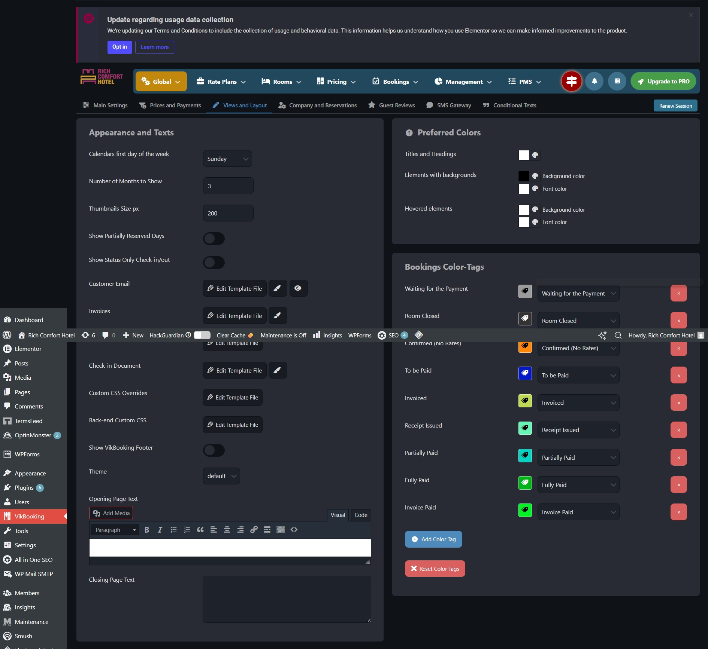

  
<strong>vikbooking_integration_richchotel.com.jpeg</strong>

  **What this shows:** VikBooking integration confirmation/configuration (booking engine connected and active within WordPress).  
  **Why it matters:** Ensures bookings are processed consistently and operationally managed via the plugin backend.

  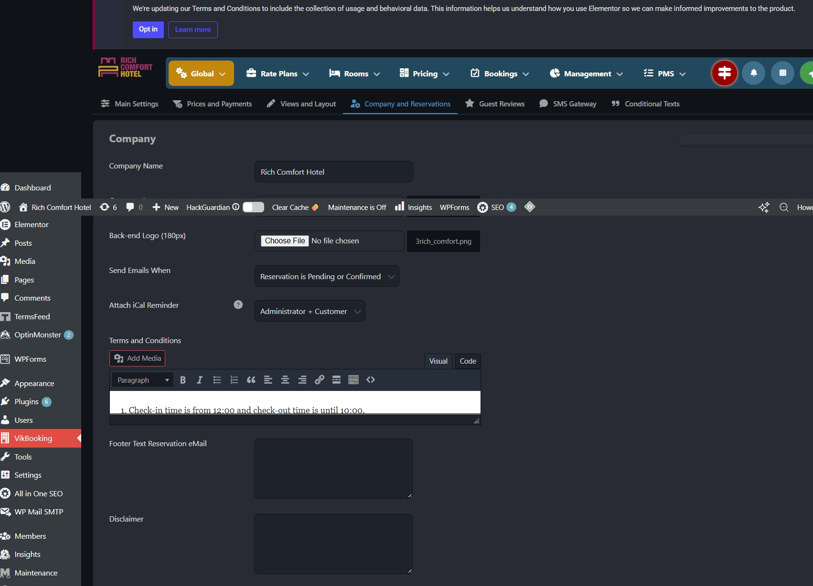

  
<strong>vikbooking_payments_integration_richchotel.com.jpeg</strong>

  **What this shows:** Payments configuration inside VikBooking (method setup and booking payment behaviour).  
  **Why it matters:** Defines how guests are instructed to pay, what appears on confirmation pages/emails, and what status is applied to bookings.

  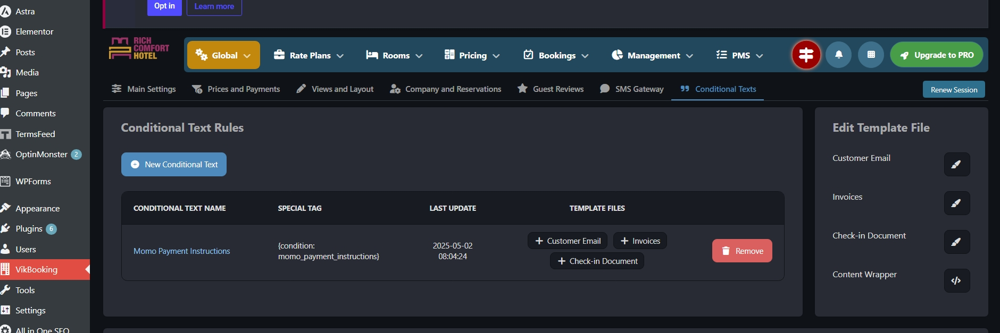

  
<strong>wp_forms_integration_richchotel.com.jpeg</strong>

  **What this shows:** WPForms integration used to support enquiries or structured requests alongside the booking flow.  
  **Why it matters:** Adds a reliable contact/enquiry channel and improves conversion for guests with questions before booking.

  

  
<strong>customer_email_integration_richchotel.com.PNG</strong>

  **What this shows:** Customer email integration/configuration (confirmation messaging and booking communication readiness).  
  **Why it matters:** Booking confirmations and automated messages reduce no-shows, clarify next steps, and improve guest trust.

  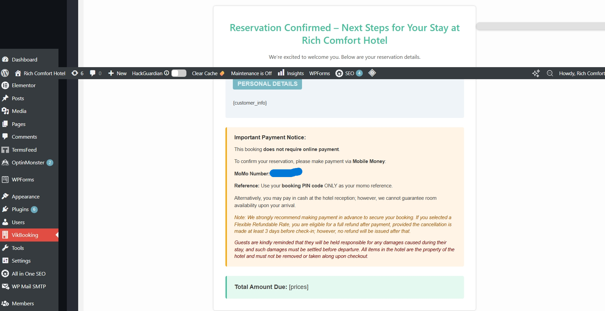

  
<strong>website_visits_report_richchotel.com.jpeg</strong>

  **What this shows:** Website visits reporting view (traffic tracking over time).  
  **Why it matters:** Helps measure marketing effectiveness and identify periods of high/low interest for optimisation.

  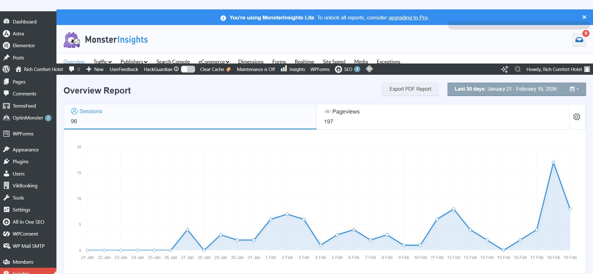

  
<strong>website_engagement_report_from_start_richchotel.com.jpeg</strong>

  **What this shows:** Engagement reporting from inception (overall usage signals such as page views/sessions and peak times).  
  **Why it matters:** Provides baseline analytics for growth tracking and supports decisions on content updates and promotions.

  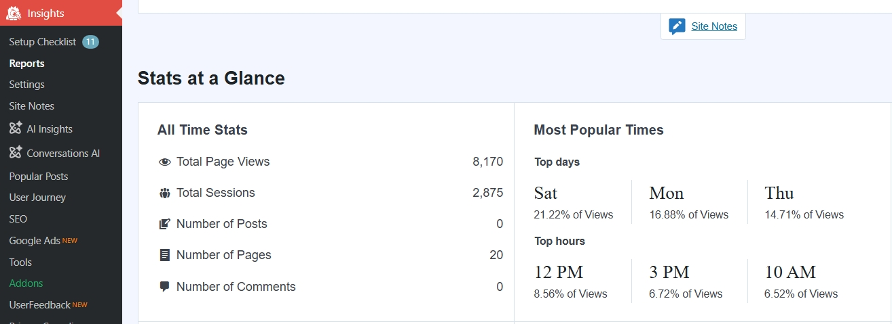

---

## Notes
- Screenshots are kept in this folder and referenced directly for portability.
- File naming is intentionally consistent to keep evidence searchable and review-friendly.
